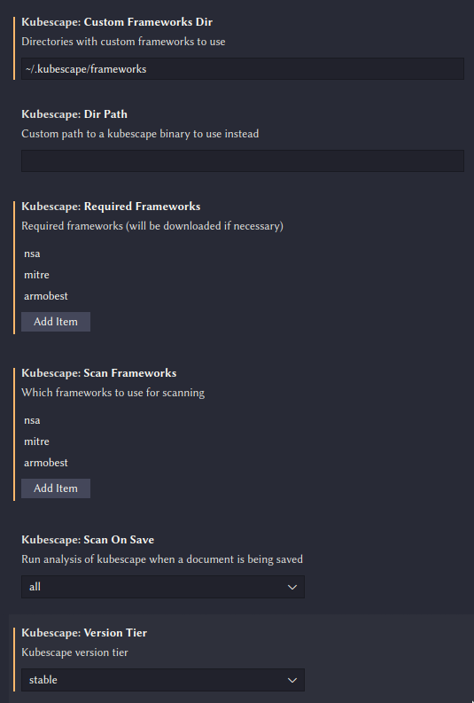

# Kubescape

Visual studio extension the utilize the power 💪 of [Kubescape](https://github.com/armosec/kubescape) directly into your
favorite text editor.

## ✨ Features

### Scan yaml files and get analysis from Kubescape.

Yaml files can be scanned using a commands.
You can access any of this extension commands by opening the Command Palette (Ctrl+Shift+P on Linux/Windows and Cmd+Shift+P on Mac), and then typing in the command name.

The default behavior also scans yaml files on save 💾.

Scanning results are marked and can be found in `vscode` 'PROBLEMS' tab. There is also a hover info that can be viewed on marked positions.

## 🔒 Requirements

This extension downloads the latest Kubescape version.
However, it is recommended to have Kubescape installed in your path.

## ⚙️ Configuration

Currently the following options can be configured:

+ `Dir Path` - A directory to override kubescape location. Uses the extension directory by default.
+ `Scan Frameworks` - Which frameworks should be used for scanning. Allows providing custom frameworks as well.
+ `Scan On Save` - Which file formats should auto run analysis on save. 
+ `Version Tier` - Choosing between kubescape stable version and latest version if you like bleeding adge.

## 💼 Marketplace

This extension is available officially at either:

- [Microsoft VScode Extensions Marketplace](https://marketplace.visualstudio.com/items?itemName=kubescape.kubescape)
- [Open VSX Registry](https://open-vsx.org/extension/kubescape/kubescape)
- [Kubescape Github Releases](https://github.com/armosec/kubescape/releases)

## 🗒️ Release Notes

See [Change Log](./CHANGELOG.md)
